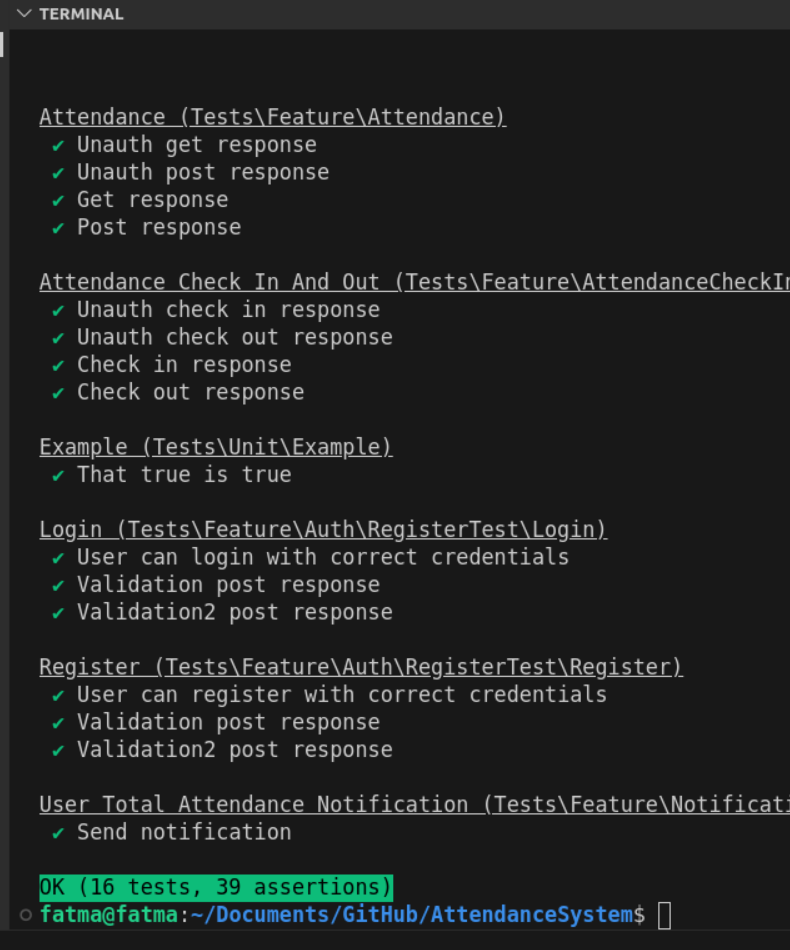
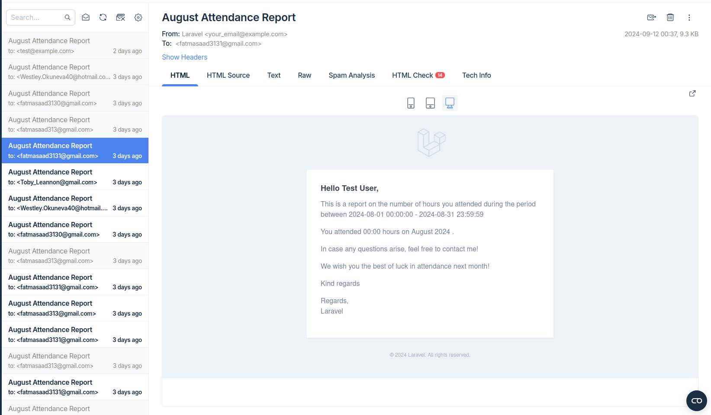
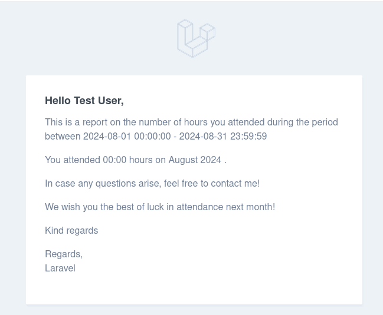

# Attendance System

The goal is to develop a simple attendance system backend that allows users to track their
working hours. The system should allow users to check in and check out multiple times per day,
calculate total hours worked, and provide statistics on working hours and days. Additionally,
users should receive notifications with their monthly working stats.

- User should be able to [sign-in](#sign-in) : By his/her ID and Password .

- User should be able to [check-in](#check-in) : Check-in time will be fetched from the now time , Example ( if Authenticated user check in “2024-1-1 12:33:44” then this time will be saved as check-in time )

- User should be able to [check-out](#check-out) : Check-out time will be fetched from the now time , Example ( if Authenticated user check out “2024-1-1 12:33:44” then this time will be saved as check-out time )

- User can has multiple check-ins/check-outs per the same day

- User can view the [total number of hours that he worked](#Total-Attendance-Hours) by using from/to date , Example
(if Authenticated user entered from 2024-1-1 to 2024-3-13 then he/she can view the
total number of hours )

- User should receive [Notification](#Notification) at the first day of the month about the total number of hours that he/she worked in the previous month , Example ( let’s assume that today is
1-3-2024 then I should receive a Notification about the total number of hours that I
worked in February )

## specifications

- Backend Implementation in PHP v8.2, Laravel v11.22 and MySQL v8.0.32

- Docker setup using [sail](https://laravel.com/docs/11.x/sail#introduction) to containerize the application.

- Auto-generated Postman collection to test all the APIs using [laravel-api-to-postman](https://github.com/andreaselia/laravel-api-to-postman)

***Note*** : to generate new Postman collection
```bash
php artisan export:postman

```

- All API endpoints documented

- All API endpoints [unit-tested](#Unit-Test).


## How to use
Alternative installation is possible without local dependencies relying on [Docker](#Docker). 

Clone the repository
```bash
    git clone git@github.com:FatmaSaad/attendance-system.git
```

Switch to the repo folder
```bash
 cd attendance-system
 ```
Install all the dependencies using composer
```bash
 composer install
```
Copy the example env file and make the required configuration changes in the .env file
```bash
 cp .env.example .env
```
Generate a new application key
```bash
 php artisan key:generate
```

Run the database migrations (**Set the database connection in .env before migrating**)
```bash
 php artisan migrate
```
Start the local development server

```bash
 php artisan serve
```
You can now access the server at http://localhost:8000

**TL;DR command list**

```bash
 git clone git@github.com:FatmaSaad/Attendance-system.git
 cd attendance-system
 composer install
 cp .env.example .env
 php artisan key:generate
 php artisan jwt:generate 

 ```
**Make sure you set the correct database connection information before running the migrations** 

```bash
 php artisan migrate
 php artisan serve
```
### Database seeding

Run the database seeder and you're done

```bash
 php artisan db:seed
```
***Note*** : It's recommended to have a clean database before seeding. You can refresh your migrations at any point to clean the database by running the following command

```bash
 php artisan migrate:refresh
```  
### Unit Test

- you may use the test Artisan command to run all tests.

```bash
vendor/bin/phpunit --testdox
```


### Docker
Use [sail](https://laravel.com/docs/11.x/sail#introduction) which is an interface for interacting with  [Docker](https://www.docker.com/) development environment to install the attendance-system.

make sure your docker [installed and running](https://docs.docker.com/engine/install/).

In your terminal, use this command:

```bash
sail up
```
or

```bash
./vendor/bin/sail up
```
This command starts all the Docker containers required for Laravel development environment.

Run 

```bash
sail artisan migrate:fresh --seed
```
 This will create the database and insert a few fake records into it.


## Start the fun and let's use our attendance system 

### Sign-in
- register as a new user using [/api/register](#Sign-in)
 you need to send your {user_id,name,email,password and password_confirmation}.

- use your user_id and Password to log in using [/api/login](#Sign-in) 
    ***Note*** : you can skip this step as there is a user saved by defult. 
 to use it please use these credentials to log In:
```bash
user_id = 123
password = 123456

```
### Check-in
- as an authenticated user you can check in now by calling **GET** [/api/check_in](#Check-in)
 your response has  **"status": "In"** as you now attended.
### Check-out
- if you need to check out you cal call **GET** [/api/check_out](#Check-out)
 so you can respond **"status": "Out"**
                         **"attendance_hours": "02:05:56"**
### Total Attendance Hours
just call  **POST** [/api/attendance](#Total-Attendance-Hours)
- if you sent (from) and (to) parameters in the request body
 you will get your total number of hours that attended during this specific period of time by using from/to date.

- if empty request body
 you will get your total number of hours in general.
      ***Note*** : you can reach these attended points with dates and attended time for each one just call **GET** [/api/attendance](#Total-Attendance-Hours)
      
### Notification
- automatically you receive a notification at the first day of the month about the total number of hours that you worked in the previous month.
- to minimise integrations I chose to send these notifications by email.
- in my case i integrated with [mailtrap](https://mailtrap.io) just to receive my emails



- don`t forget to run

```bash
php artisan schedule:work
```
This command will run in the foreground and invoke the scheduler every minute until you terminate.

 ***Note***  if you want to test it manually just run 
```bash
 php artisan app:send-attendance-notifications
 
```
In the end, you should receive something like that

